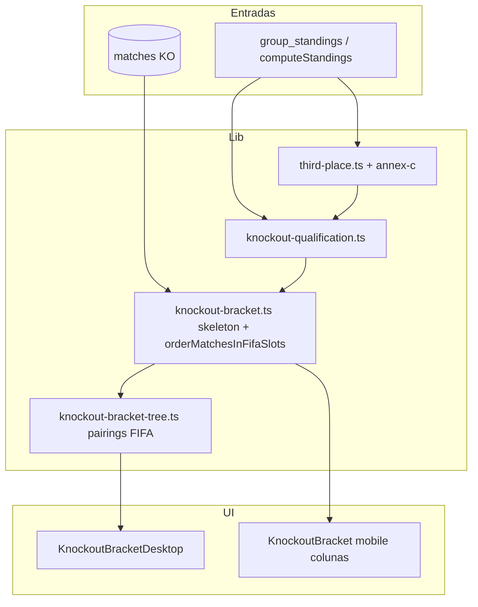

# Handoff de sessão — 23 Junho 2026

Documento para retomar trabalho ou onboarding. **Última actualização:** 2026-06-23.  
**Commits principais:** `82a8cd1` → `8b98b2c` (todos em `main`, deploy Vercel automático).

---

## Resumo executivo

Sessão focada em **homepage** (pesquisa por equipa, dia de jogos, melhores marcadores) e **fase final** (lógica FIFA dos 3.ºs, chave visual correcta). Várias correcções de i18n PT-PT e bugs de UI.

| Área | O que mudou |
|------|-------------|
| Homepage | Pesquisa equipa, vista «Dia de jogos» vs «Por data», melhores marcadores |
| `/fasefinal` | Annex C (495 combinações), ordem FIFA M73–M104, rótulos de seed, datas nos cartões |
| i18n | PT-PT: dezasseis-avos, oitavas, Agendado, Melhores Marcadores |
| Fixes | Datas nos cards, crash ao mudar vista, pesquisa mostra todos os jogos da equipa |

---

## Commits (ordem cronológica)

| Commit | Descrição |
|--------|-----------|
| `31f94b4` | i18n: nomes das rondas eliminatórias PT-PT vs PT-BR |
| `82a8cd1` | Annex C 3.ºs, pesquisa por equipa, vista dia de jogos |
| `4782d94` | Datas compactas nos cards, pesquisa com jogos passados/live/futuros, fix crash vista |
| `a400a89` | PT-PT: «Agendado» em vez de «Por começar» |
| `663520f` | Melhores marcadores na home + enriquecimento cartões bracket |
| `8b98b2c` | Ordem FIFA na chave + label PT-PT «Melhores Marcadores» |

---

## 1. Pesquisa por equipa

**Ficheiros:** `src/components/TeamSearch.tsx`, `src/app/page.tsx`, `src/lib/matches.ts` (`getAllTeams`).

- Autocomplete com todas as equipas do torneio.
- URL: `/?team={team_id}`.
- Quando activa: lista **todos** os jogos da equipa (passados, live, futuros), cronologicamente.
- Esconde tabs de dia e toggle «Dia de jogos / Por data».
- Esconde classificações do dia e melhores marcadores.

**i18n:** `search.*`, `matches.noTeamMatches*`.

---

## 2. Vista «Dia de jogos» vs «Por data»

**Ficheiros:** `src/lib/tournament-days.ts`, `src/components/MatchesView.tsx`.

Inspirado em feedback Reddit: o «dia» do Mundial não é meia-noite civil — jogos até às **06:00** contam para o dia anterior do torneio.

- **Dia de jogos** (default): tabs numeradas (`td-1`, `td-2`, …), cutoff 06:00 no timezone do utilizador.
- **Por data**: tabs por data civil (`YYYY-MM-DD`).
- URL: `?view=calendar` para vista por data.

**Fix (`4782d94`):** `activeTab` derivado + `isCalendarDayKey()` — evitava crash ao alternar vistas quando o tab activo era `td-N` e `displayDate()` recebia chave inválida.

**i18n:** `matches.view.tournament`, `matches.view.calendar`, `matches.tournamentDay`, `matches.tournamentDayHeading`.

---

## 3. Melhores marcadores (homepage)

**Ficheiros:** `src/lib/top-scorers.ts`, `src/components/TopScorers.tsx`, `MatchesView.tsx`.

- Agrega `goal_events` de todos os jogos na BD.
- Exclui autogolos (`detail === "Own Goal"`).
- Ordenação: golos ↓, nome jogador, equipa.
- UI: top 5, expandir até 15 («Ver mais»).
- Componente retorna `null` se não há marcadores.
- **PT-PT:** «Melhores Marcadores» (`topScorers.title`). **PT-BR:** mantém «Artilharia».

**i18n:** `topScorers.title`, `topScorers.showMore` (10 locales).

---

## 4. Fase final — lógica FIFA dos 3.ºs (Annex C)

**Ficheiros:**

| Ficheiro | Função |
|----------|--------|
| `src/lib/knockout-annex-c.ts` | 495 linhas Annex C (fonte: [manganite/wm2026](https://github.com/manganite/wm2026)) |
| `src/lib/third-place.ts` | Ranking dos 8 melhores 3.ºs; `buildThirdPlaceContext()` |
| `src/lib/knockout-qualification.ts` | Resolve slots `1A`–`2L` e `3º` via Annex C |
| `src/lib/knockout-slot-labels.ts` | Rótulos «1.º Gr. E», «3.º Gr. C» (PT por agora) |

### Ranking dos 8 melhores 3.ºs (Art. 13 FIFA)

1. Pontos  
2. Diferença de golos  
3. Golos marcados  
4. Nome (fair-play não está na BD)

### Resolução de slots `3º`

No skeleton R32, o adversário `3º` de um jogo depende do **vencedor do grupo** no lado `home` (ex. `1E` vs `3º` → Annex C diz qual grupo do 3.º classificado enfrenta o 1.º do Gr. E).

`enrichSlotPreview()` passa `thirdPlaceWinnerGroup` quando `away === "3º"`.

### Validação vs Excel do utilizador

Com classificações reais na BD, o site pode divergir de simulações manuais se os pontos dos 3.ºs não coincidirem (ex. Escócia 1 pt na BD vs 3 pts num Excel). A **fonte de verdade do site** são as regras FIFA + dados sincronizados, não folhas externas.

---

## 5. Fase final — ordem FIFA e árvore visual

### Problema original

1. **`KNOCKOUT_SKELETON`** — jogos R32/R16 fora da ordem dos números FIFA (M73–M96).
2. **`buildSideTree()`** — emparelhamento binário adjacente (folha 0+1 → oitavo 0) **não** reflecte o encadeamento FIFA (ex. M90 = V73 vs V75, não V73 vs V74).
3. **Jogos da BD** — ordenados por `kickoff_utc`, não pelo slot FIFA → cartões no sítio errado da chave.

### Solução (`8b98b2c`)

**`src/lib/knockout-fifa-order.ts`**

- `FIFA_MATCH_NUMBERS` — M73–M104 por ronda.
- `R32_TREE_LEAF_ORDER` — permutação das folhas R32 em cada metade para a árvore desktop.
- Pairings explícitos: R32→R16, R16→QF, QF→SF (índices locais + mapeamento FIFA).
- `orderMatchesInFifaSlots()` — coloca jogos reais no índice correcto (match por equipas vs preview; fallback kickoff).

**`src/lib/knockout-bracket.ts`**

- Skeleton R32 na ordem M73–M88 (oficial FIFA).
- Skeleton R16 na ordem M89–M96.
- `buildKnockoutColumns()` chama `orderMatchesInFifaSlots` após gerar previews.

**`src/lib/knockout-bracket-tree.ts`**

- Substitui `pairLevels` genérico por `mergeWithPairings()` com constantes de `knockout-fifa-order.ts`.

### Ordem R32 (referência rápida)

| M# | Confronto |
|----|-----------|
| 73 | 2A vs 2B |
| 74 | 1E vs 3º |
| 75 | 1F vs 2C |
| 76 | 1C vs 2F |
| 77 | 1I vs 3º |
| 78 | 2E vs 2I |
| 79 | 1A vs 3º |
| 80 | 1L vs 3º |
| 81 | 1D vs 3º |
| 82 | 1G vs 3º |
| 83 | 2K vs 2L |
| 84 | 1H vs 2J |
| 85 | 1B vs 3º |
| 86 | 1J vs 2H |
| 87 | 1K vs 3º |
| 88 | 2D vs 2G |

### Cartões do bracket (`BracketSlotCard`)

- **Preview:** rótulo de seed sob o nome (`formatBracketSlotLabel`).
- **Jogo real:** data compacta + hora (`MatchCompactDate` · `KickoffTime`).

---

## 6. i18n PT-PT vs PT-BR (eliminatórias)

| Chave | PT-PT | PT-BR |
|-------|-------|-------|
| `knockouts.round.r32` | Dezasseis avos | Fase de 32 |
| `knockouts.round.r16` | Oitavos | Oitavas |
| `status.upcoming` | Agendado | (ver `br.ts`) |
| `topScorers.title` | Melhores Marcadores | Artilharia |

Rótulos de seed no bracket (`1.º Gr. X`) estão em português europeu hardcoded em `knockout-slot-labels.ts` — **localizar por locale** fica como melhoria futura.

---

## 7. Outras correcções de UI

| Issue | Fix |
|-------|-----|
| Data nos cards | `formatCompactMatchDate()` → «22 jun» (`src/lib/datetime.ts`, `Display.tsx`) |
| Pesquisa só jogos futuros | Filtro alargado a todos os estados |
| Crash ao mudar vista | `activeTab` + guard `isCalendarDayKey()` |

---

## Diagrama — fluxo da chave



---

## Ficheiros novos (esta sessão)

```
src/components/TeamSearch.tsx
src/components/TopScorers.tsx
src/lib/tournament-days.ts
src/lib/top-scorers.ts
src/lib/third-place.ts
src/lib/knockout-annex-c.ts
src/lib/knockout-slot-labels.ts
src/lib/knockout-fifa-order.ts
```

---

## Pendências / melhorias futuras

- [ ] Localizar rótulos de seed do bracket (`1.º Gr. X`) nos 10 idiomas.
- [ ] Expandir jogos de grupo por jornada (inspiração mundial-ferd).
- [ ] Desempate H2H nas classificações se empates relevantes surgirem.
- [ ] Bump `WHATS_NEW_VERSION` + entradas no banner quando fizer release `0.5.1` ou `0.6.0`.
- [ ] Testes unitários para `orderMatchesInFifaSlots`, `rankThirdPlaceCandidates`, Annex C lookup.

---

## Verificação rápida em produção

```bash
# Homepage — pesquisa
open "https://wc26.pt/?team=27"   # substituir ID

# Vista calendário
open "https://wc26.pt/?view=calendar"

# Chave
open "https://wc26.pt/fasefinal"
```

Confirmar: sem equipa duplicada em dois slots R32; 3.ºs coerentes com Annex C; «Melhores Marcadores» em PT-PT.

---

## Referências

- [FIFA WC26 match schedule (PDF)](https://digitalhub.fifa.com/m/1be9ce37eb98fcc5/original/FWC26-Match-Schedule/_English.pdf)
- Annex C: regulamento oficial / [manganite/wm2026](https://github.com/manganite/wm2026)
- Site inspiração (sem copiar simulação Monte Carlo): mundial-ferd.vercel.app
